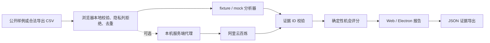

# 架构与信任边界

## 信任边界

- CSV 默认只在浏览器处理；只有用户明确选择百炼模式时才应发送必要字段。
- `BAILIAN_API_KEY` 只存在于服务端进程环境，前端 bundle、日志和导出报告均不得包含。
- 本地代理仅监听 `127.0.0.1`，拒绝非本机 Origin、非 JSON、超过 1 MB 的请求，并设置 20 秒超时。
- 模型输出必须引用存在的评论或政策 ID；未知 ID 会中止报告生成。
- 机会分数是固定公式；合规结论始终要求人工复核。
- 前端启动时只查询 `/health` 的布尔配置状态；服务端未配置、离线或模型响应无效时，界面保留/恢复 fixture 确定性报告。

## 状态转换

`内置样例 → 选择 CSV → 校验失败并保留原报告 / 校验成功并替换评论 → 重新生成确定性报告 → 调整定价假设 → 导出快照`

CSV 失败不会清空已有报告；浏览器刷新会回到无密钥、无网络依赖的内置样例。
